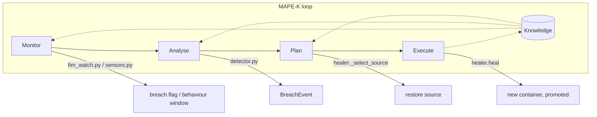
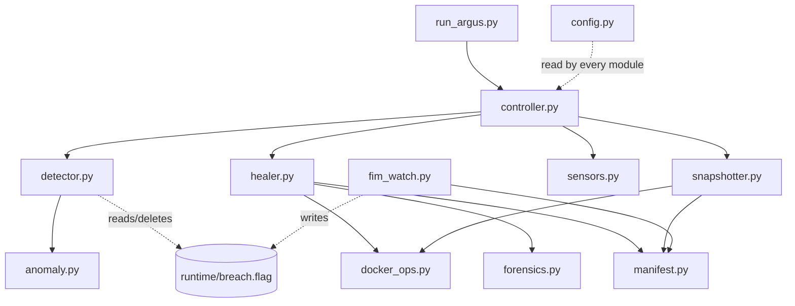

# Architecture

Argus is an autonomic controller, structured as a **MAPE-K loop** (Monitor–Analyse–Plan–
Execute, over shared Knowledge) — the standard reference model for self-healing systems.

| MAPE-K stage | Module | Responsibility |
|---|---|---|
| Monitor | `fim_watch.py`, `sensors.py` | Watch the protected directory and host behaviour |
| Analyse | `detector.py` | Fuse signature + anomaly evidence into one decision |
| Plan | `healer._select_source` | Choose what to restore from |
| Execute | `healer.heal` | Run the eight-step heal sequence |
| Knowledge | `manifest.py`, snapshots, golden baseline, `incidents.csv` | Shared state every stage reads or writes |

## Module map

## Layering, pure to impure

The decomposition maps cleanly onto MAPE-K, in three layers:

**Pure, Docker-free, unit-testable** — `manifest.py` (hashing/verification, the cleanest
module in the project: one job, no dependencies beyond stdlib), `metrics.py` (the
`Incident` dataclass, CSV persistence, statistical reducers), `anomaly.py` (the
IsolationForest wrapper), `config.py` (typed tunables, one dataclass, no magic numbers
scattered elsewhere).

**Filesystem-bound, dependency-injected** — `snapshotter.py` (takes a `copy_out_fn`
callable rather than a concrete `DockerOps`, a genuinely good seam for testing),
`forensics.py` (filesystem side of evidence capture only; container commit is correctly
delegated to `docker_ops`), `fim_watch.py` (an alternative detection source that
communicates with `detector.py` purely through the existence of `breach.flag` — a clean,
well-documented interface and one of the better-defended design decisions in the
codebase).

**Docker-bound** — `docker_ops.py` only, by design: every Docker interaction the healer
needs goes through one class, so the test suite can substitute a fake and exercise the
whole resilience loop without a live daemon.

**Orchestration** — `healer.py` (the Execute stage, sequenced and documented step by
step), `controller.py` (wiring plus the two timers: a fast detection tick and a slow
snapshot tick).

## Honest boundary violations

Three places where the layering above is not quite what it claims to be — worth stating
explicitly rather than leaving implicit:

1. **`docker_ops.py` is not the only Docker seam.** `sensors.py` shells out to the `docker`
   CLI directly for `docker stats` and `docker exec`, so the "one mockable Docker
   boundary" the module's own docstring claims is not quite true, and the sensor layer is
   not unit-testable without a live daemon.
2. **`healer.py` reaches around `docker_ops.py` to the filesystem.** `_reset_host_webroot`
   manipulates the host bind mount directly with `shutil`. This is the correct fix for the
   heal-loop bug (see `docs/AUDIT-FINDINGS.md`), but it means the healer now owns knowledge
   of the bind-mount topology that was previously encapsulated inside `docker_ops`.
3. **The Knowledge layer is implicit and shaped like a set of file paths**, not a module.
   `breach.flag`, `attack_marker.json`, `golden_manifest.json`, the snapshot tree, and
   `incidents.csv` are collectively the K of MAPE-K, but no module owns them as a group —
   each consumer opens its own paths from `config.py`, so the invariants (who writes, who
   consumes, who is allowed to delete) live only in docstrings, not in code. This is the
   root cause of several cross-process races documented in `docs/AUDIT-FINDINGS.md`.

## The trust anchor

`argus/dvwa-golden:latest` is a **re-tag** of `vulnerables/web-dvwa:latest`, not an
independently built or hardened image — there is no Dockerfile. Because the web root is
bind-mounted over `/var/www/html`, the golden *image* only ever contributes the OS/PHP
base; the executable PHP content a restore lays down always comes from the host side (a
snapshot, or `runtime/golden_webroot`). The stated design principle "the executable base
is never the compromised one" needs that qualification: it is true of the base image, not
of the content served from it.

`config/golden_manifest.json` is built by hashing whatever is currently in the live web
root at the moment `init-golden` runs. There is no check that the root is actually
pristine at that moment — see `docs/AUDIT-FINDINGS.md` for the consequence if it isn't.
