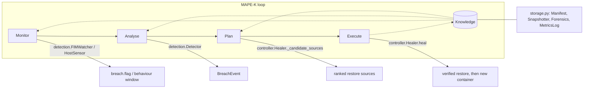
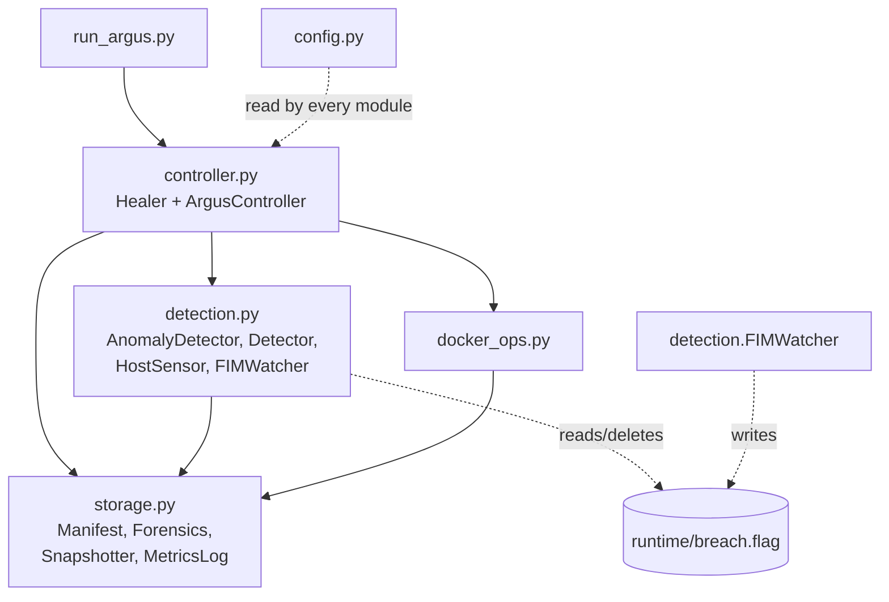

# Architecture

Argus is an autonomic controller, structured as a **MAPE-K loop** (Monitor–Analyse–Plan–
Execute, over shared Knowledge) — the standard reference model for self-healing systems.
The package has **five modules**, deliberately one per MAPE-K concern.

```mermaid
flowchart LR
    subgraph MAPE-K loop
        M[Monitor] --> A[Analyse] --> P[Plan] --> E[Execute]
        E -.-> K[(Knowledge)]
        K -.-> M
        K -.-> A
        K -.-> P
    end
    M -->|"detection.FIMWatcher / HostSensor"| M1[breach.flag / behaviour window]
    A -->|"detection.Detector"| A1[BreachEvent]
    P -->|"controller.Healer._candidate_sources"| P1[ranked restore sources]
    E -->|"controller.Healer.heal"| E1[verified restore, then new container]
    K --- K1["storage.py: Manifest, Snapshotter, Forensics, MetricsLog"]
```

| MAPE-K stage | Where | Responsibility |
|---|---|---|
| Monitor | `detection.py` — `FIMWatcher`, `HostSensor` | Watch the protected directory and host behaviour |
| Analyse | `detection.py` — `AnomalyDetector`, `Detector` | Fuse signature + anomaly evidence into one decision |
| Plan | `controller.py` — `Healer._candidate_sources` | Rank what to restore from |
| Execute | `controller.py` — `Healer.heal` | Run the heal sequence (see `flow.md`) |
| Knowledge | `storage.py` — `Manifest`, `Snapshotter`, `Forensics`, `MetricsLog` | Shared state every stage reads or writes |

## Module map

```mermaid
graph TD
    CLI[run_argus.py] --> Controller["controller.py<br/>Healer + ArgusController"]
    Controller --> Detection["detection.py<br/>AnomalyDetector, Detector,<br/>HostSensor, FIMWatcher"]
    Controller --> Storage["storage.py<br/>Manifest, Forensics,<br/>Snapshotter, MetricsLog"]
    Controller --> DockerOps[docker_ops.py]
    Detection --> Storage
    Detection -.reads/deletes.-> BreachFlag[(runtime/breach.flag)]
    Watch["detection.FIMWatcher"] -.writes.-> BreachFlag
    DockerOps --> Storage
    Config[config.py] -.read by every module.-> Controller
```

`docker_ops.py` imports one small thing from `storage.py` (the `IncompleteCapture`
exception); nothing in `storage.py` knows about Docker or the network.

## Layering, pure to impure

**Pure, Docker-free, unit-testable** — `config.py` (typed tunables, one dataclass, strict
loading: an unknown key or a missing file is an error, not a silent fallback) and most of
`storage.py` (`Manifest` hashing/verification, `MetricsLog` CSV persistence and reducers).

**Filesystem-bound, dependency-injected** — `Snapshotter` takes a `copy_out_fn` callable
rather than a concrete `DockerOps`; `Forensics` owns only the filesystem side of evidence
capture (the container commit is delegated to `docker_ops`); `FIMWatcher` talks to
`Detector` purely through the existence of `breach.flag`, so Wazuh and the lightweight
watcher are interchangeable writers of the same file.

**Docker-bound** — `docker_ops.py`, by design: every Docker interaction the healer needs
goes through one class, so the test suite substitutes a fake and exercises the whole
resilience loop without a live daemon. It also treats archives from the (assumed
compromised) container as hostile input — see `design.md`.

**Orchestration** — `controller.py`: `Healer` (the Execute stage) and `ArgusController`
(wiring plus the two timers: a fast detection tick and a slow snapshot tick).

## Honest boundary violations

Places where the layering above is not quite what it claims — stated rather than left
implicit:

1. **`docker_ops.py` is not the only Docker seam.** `HostSensor` shells out to the `docker`
   CLI directly for `docker stats` and `docker exec`, so the sensor layer is not
   unit-testable without a live daemon. (Readings are now cached for 10 s so this no
   longer stretches the detection period, and the sensor is not constructed at all when no
   anomaly model is loaded.)
2. **`Healer` reaches around `docker_ops.py` to the filesystem.** `_reset_host_webroot`
   manipulates the host bind mount directly with `shutil`. That is the correct fix for the
   heal-loop bug (see `AUDIT-FINDINGS.md`), but it means the healer owns knowledge of the
   bind-mount topology.
3. **Some Knowledge is still just file paths.** `storage.py` now groups the manifest,
   snapshot, forensics and metrics classes, but `breach.flag` and `attack_marker.json` are
   cross-process handoff files whose writer/consumer rules live in docstrings, not code.
   The marker now has an age limit and atomic writes to blunt the races this allowed.

## The trust anchor

`argus/dvwa-golden:latest` is a **re-tag** of `vulnerables/web-dvwa:latest`, not an
independently built or hardened image — there is no Dockerfile. Because the web root is
bind-mounted over `/var/www/html`, the golden *image* only ever contributes the OS/PHP
base; the executable PHP content a restore lays down always comes from the host side (a
snapshot, or `runtime/golden_webroot`). The principle "the executable base is never the
compromised one" needs that qualification: it is true of the base image, not of the
content served from it — which is why every restore is verified against a manifest before
anything is launched.

`config/golden_manifest.json` is built by hashing whatever is currently in the live web
root at the moment `init-golden` runs. There is no check that the root is actually
pristine at that moment: run `init-golden` on a clean, freshly seeded web root only.
