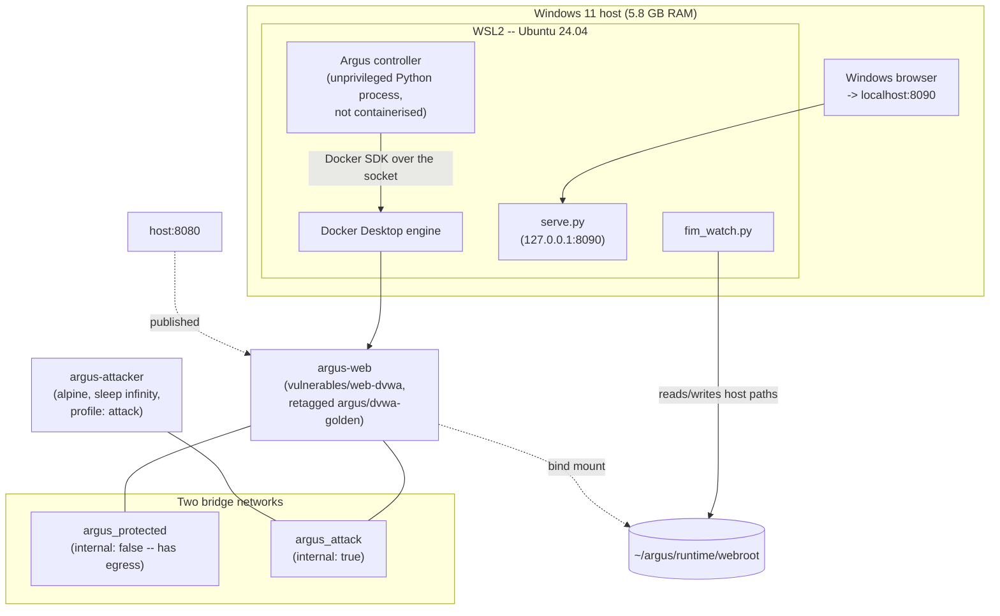

# Deployment topology

## Host stack

The controller itself is **not containerised** — it runs as a plain Python process inside
the WSL2 Ubuntu userspace, talking to the Docker engine through the Python SDK
(`docker.from_env()`), which is why the project root must live on WSL2's native ext4
(`~/argus`), not under `/mnt/c`: filesystem watching is materially faster there, and it's
what real-time FIM depends on.

## Containers

| Container | Image | Networks | Ports | Lifecycle |
|---|---|---|---|---|
| `argus-web` | `vulnerables/web-dvwa:latest`, retagged `argus/dvwa-golden:latest` for rebuilds | `argus_protected` + `argus_attack` | `8080 → 80` | `restart: "no"` — Argus owns the lifecycle after the first heal, not `docker compose` |
| `argus-attacker` | `alpine:3.19` | `argus_attack` only | none | `sleep infinity`; only started with `--profile attack` |

**Known issue** (see `docs/AUDIT-FINDINGS.md`, M6): the `8080:80` port mapping binds
`0.0.0.0`, not `127.0.0.1` — DVWA is reachable from the local network, not just this
machine. The same defect is reproduced in `healer.py` for every container created after a
heal. This should be fixed before running the lab on any network you don't fully trust.

## Networks

| Network | Driver | `internal` | Purpose |
|---|---|---|---|
| `argus_protected` | bridge | `false` (has internet egress) | The network the healer disconnects to "isolate" a compromised instance |
| `argus_attack` | bridge | `true` | The attacker's reachability into the target; isolated from the real LAN |

Because `argus-web` bridges both networks, the isolation is partial: disconnecting only
`argus_protected` (which is what `healer.py` currently does) leaves the container reachable
on `argus_attack` for the few seconds between isolate and destroy. And because
`argus_protected` itself has internet egress, a successful compromise could theoretically
reach out before being destroyed — a caveat worth stating explicitly in a Limitations
section rather than assuming the network diagram alone conveys it.

## Volumes and bind mounts

Exactly one: host `~/argus/runtime/webroot` → container `/var/www/html`, read-write. This
is the pivot of the whole design — it's what lets host-side file-integrity monitoring see
the protected content directly, and what lets the controller snapshot and restore without
needing a shell inside a container that might be compromised. No named volumes exist;
DVWA's MySQL data is not persisted, so every heal also resets the database.

## Host paths Argus reads and writes

All resolved from `config/argus.yaml`, relative to `~/argus` unless noted:

| Path | Written by | Read by | Purpose |
|---|---|---|---|
| `runtime/webroot/` | DVWA, the attack harness, the healer | `fim_watch`, `snapshotter`, `manifest.verify` | The live protected content (the bind mount) |
| `runtime/golden_webroot/` | `run_argus.py init-golden` | `healer._select_source` | Pristine content copy matching the golden manifest, for a last-resort restore |
| `runtime/breach.flag` | Wazuh active-response, or `fim_watch.py` | `detector.py` (reads, then deletes) | The detection signal — a plain file, source-agnostic |
| `runtime/wazuh_alerts.json` | Wazuh manager | `detector.py`, `sensors.py` | Optional tailed alert stream, secondary signature path |
| `runtime/attack_marker.json` | `run_experiment.py` | `controller.py` (reads, then deletes) | Hands the injection timestamp across the process boundary so MTTD is measurable in daemon mode |
| `config/golden_manifest.json` | `init-golden` | `manifest.verify`, `snapshotter`, `fim_watch` | The SHA-256 trust anchor (gitignored — regenerate per machine) |
| `results/snapshots/<ts>/` + `<ts>.manifest.json` | `snapshotter.take` | `healer._select_source` | Clone cycle, last 12 retained |
| `results/forensics/<incident_id>/` | `forensics.py` | (manual inspection) | Pre-destruction evidence |
| `results/incidents.csv`, `incidents_baseline.csv` | `metrics.py` | `plot_results.py`, both HTML pages | The raw experimental record |

## Memory profile

The lab was built and validated on a **5.8 GB total, ~0.3–2 GB free** machine. Concretely:

- WSL2 requests roughly half of total RAM on startup; below a few hundred MB free it fails
  outright with `Wsl/Service/CreateInstance/CreateVm/HCS/0x800705aa`, and this can take
  already-running containers down with it.
- Docker Desktop's Wazuh stack (manager + indexer + dashboard) needs ~8GB free and is
  correspondingly documented as optional, not default.
- A stalled/starved VM can advance wall-clock time while a container does nothing —
  observed directly as a 5063-second MTTR outlier in one real run. This is a measurement
  hazard specific to running under memory pressure, not a property of the controller.

If reproducing this project on similarly constrained hardware, budget for that stall
explicitly: cap WSL2's memory via `.wslconfig`, close other applications before a
measurement run, and treat any duration far above the surrounding trials as a hardware
artefact to investigate before trusting it as data (`plot_results.py` now flags this
automatically — see `docs/AUDIT-FINDINGS.md`).
