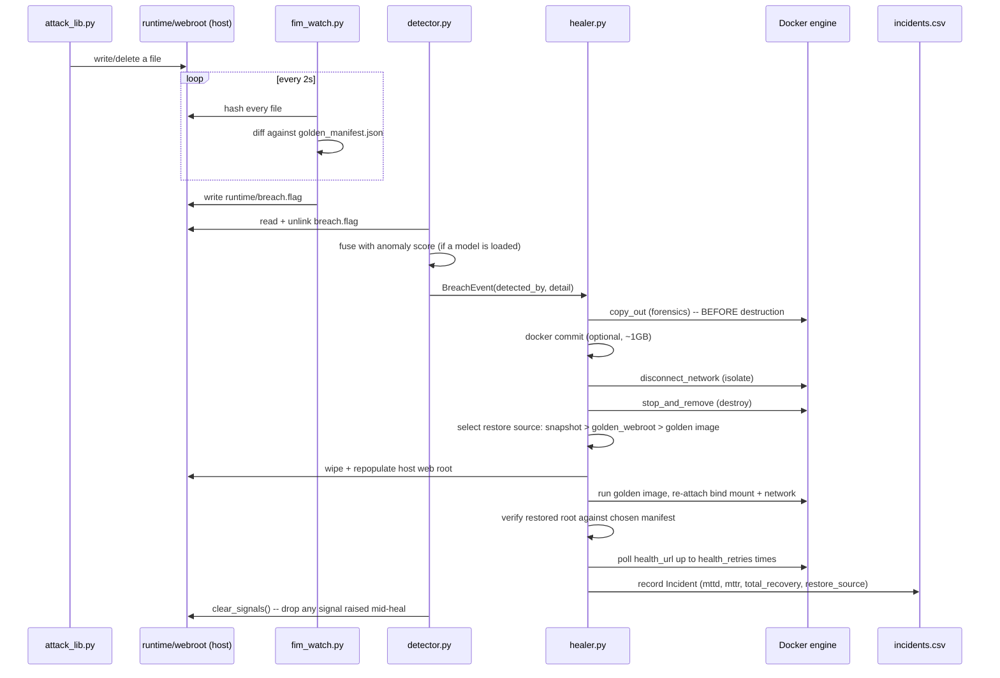
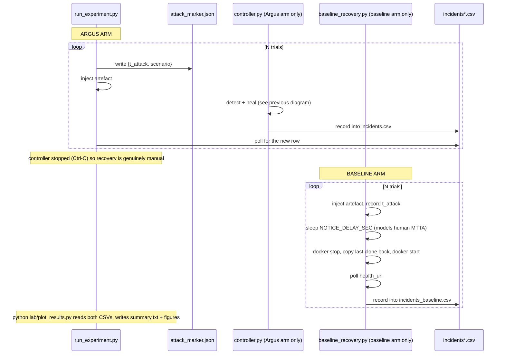
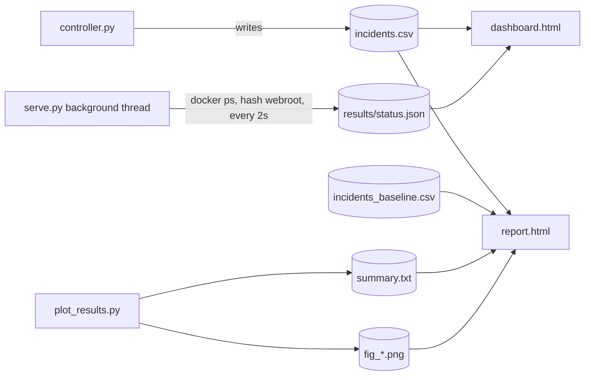

# Flow

Two flows matter: the detect→heal cycle that runs continuously, and the experiment that
measures it. Both are described here as they actually execute, file by file.

## Detect → heal, one incident

Two things about this sequence that are easy to miss reading the code top to bottom:

- **Forensic capture happens before isolation, which happens before destruction.** This
  ordering is the entire point of the "preserve evidence first" requirement, and it is why
  `copy_out` is the very first Docker call in `heal()`.
- **The healer, not `docker compose`, owns the replacement container's lifecycle.** After
  the first heal, `argus-web` is a container the healer created directly via the Docker
  SDK. Running `docker compose up -d web` again afterwards will report a name conflict —
  expected, not a bug (see `docs/RUNNING-LOCALLY.md`, Phase C.3).

## The experiment: two arms, one comparison

### Where each metric's clock starts and stops

```mermaid
gantt
    dateFormat  s
    axisFormat %Ss
    section Argus arm
    MTTD (attack -> detect)      :0, 3
    MTTR (detect -> promoted)    :3, 15
    section Baseline arm
    MTTD (modelled notice delay) :0, 30
    MTTR (detect -> healthy)     :30, 44
```

`total_recovery` spans the whole bar in both rows: attack to healthy, the fair
arm-to-arm comparison. Quoting MTTR alone hides the notice delay the controller removes —
see `docs/AUDIT-FINDINGS.md` M4 for why the total-recovery *significance test* still needs
a caveat even so.

### Known fragility in this flow

Two things worth knowing before trusting a dataset produced by this flow, detailed fully
in `docs/AUDIT-FINDINGS.md`:

- `attack_marker.json` is only deleted when a detection consumes it — a timed-out trial
  leaves it on disk, and the next detection (possibly hours later) can silently inherit
  the stale timestamp.
- The Argus arm's restore source is hash-verified against the golden baseline; the
  baseline arm's is not. The two arms do not currently share a definition of "recovered."

## Presentation data flow

`dashboard.html` and `report.html` are plain HTML+JS with no build step; `serve.py` exists
only because a browser cannot run `docker ps` or hash a directory. It now serves an
explicit allow-list of files bound to `127.0.0.1` — see `docs/AUDIT-FINDINGS.md`, fixed
finding S1, for what it used to expose.
