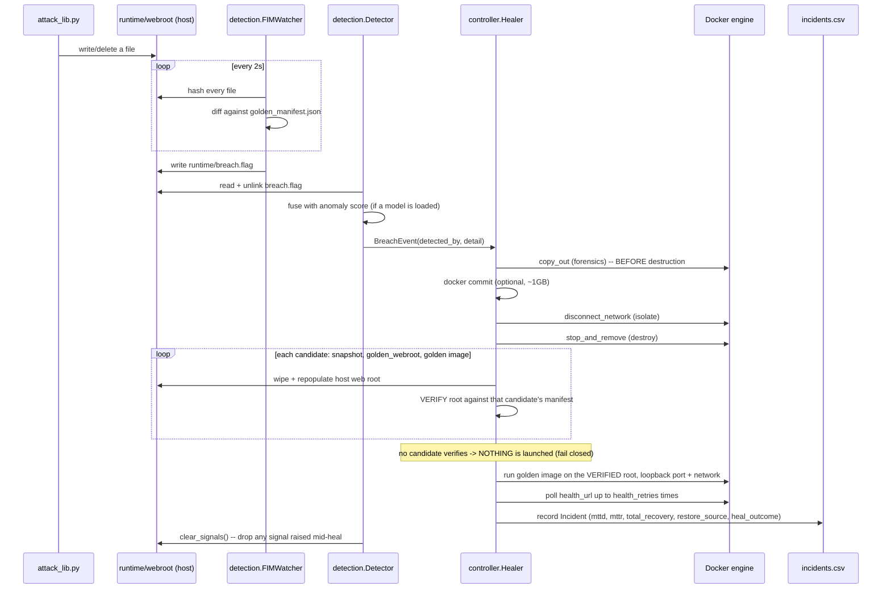
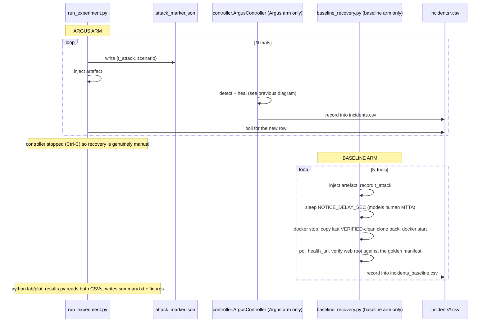
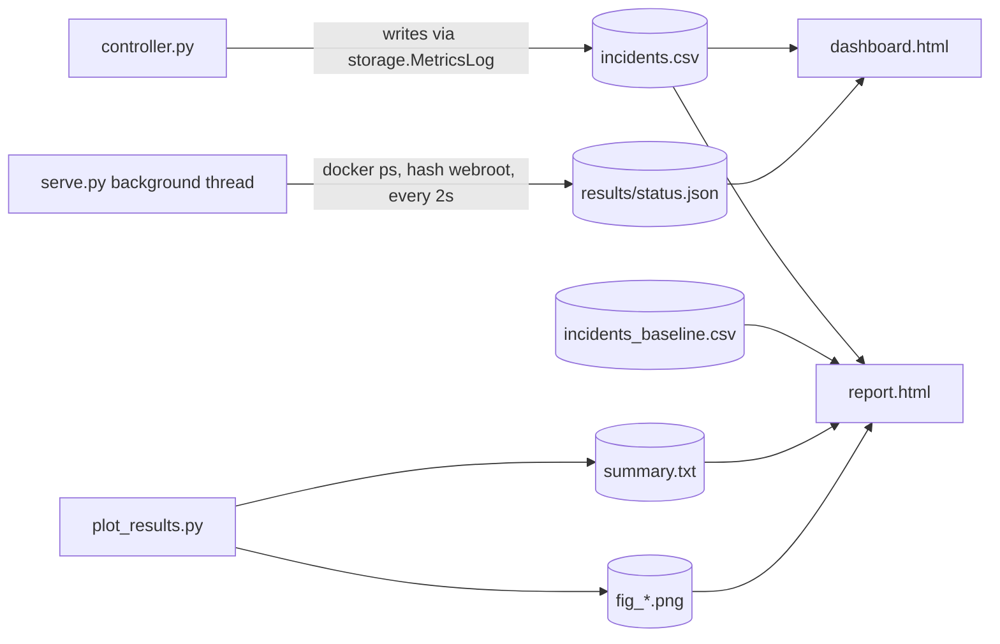

# Flow

Two flows matter: the detect→heal cycle that runs continuously, and the experiment that
measures it. Both are described here as they actually execute, file by file.

## Detect → heal, one incident

```mermaid
sequenceDiagram
    participant Attacker as attack_lib.py
    participant Root as runtime/webroot (host)
    participant Watch as detection.FIMWatcher
    participant Detector as detection.Detector
    participant Healer as controller.Healer
    participant Docker as Docker engine
    participant Metrics as incidents.csv

    Attacker->>Root: write/delete a file
    loop every 2s
        Watch->>Root: hash every file
        Watch->>Watch: diff against golden_manifest.json
    end
    Watch->>Root: write runtime/breach.flag
    Detector->>Root: read + unlink breach.flag
    Detector->>Detector: fuse with anomaly score (if a model is loaded)
    Detector->>Healer: BreachEvent(detected_by, detail)
    Healer->>Docker: copy_out (forensics) -- BEFORE destruction
    Healer->>Healer: docker commit (optional, ~1GB)
    Healer->>Docker: disconnect_network (isolate)
    Healer->>Docker: stop_and_remove (destroy)
    loop each candidate: snapshot, golden_webroot, golden image
        Healer->>Root: wipe + repopulate host web root
        Healer->>Healer: VERIFY root against that candidate's manifest
    end
    Note over Healer: no candidate verifies -> NOTHING is launched (fail closed)
    Healer->>Docker: run golden image on the VERIFIED root, loopback port + network
    Healer->>Docker: poll health_url up to health_retries times
    Healer->>Metrics: record Incident (mttd, mttr, total_recovery, restore_source, heal_outcome)
    Detector->>Root: clear_signals() -- drop any signal raised mid-heal
```

Two things about this sequence that are easy to miss reading the code top to bottom:

- **Forensic capture happens before isolation, which happens before destruction.** This
  ordering is the entire point of the "preserve evidence first" requirement, and it is why
  `copy_out` is the very first Docker call in `heal()`.
- **Verification happens before launch, not after.** The web root is a bind mount, so a
  container serves exactly the host directory it is started on. Verifying that directory
  first and only then starting the container means an unverified clone can never serve a
  request. A failed heal is still a row in `incidents.csv` (`heal_outcome` =
  `verify_failed` or `health_failed`), never a silently dropped trial.
- **The healer, not `docker compose`, owns the replacement container's lifecycle.** After
  the first heal, `argus-web` is a container the healer created directly via the Docker
  SDK. Running `docker compose up -d web` again afterwards will report a name conflict —
  expected, not a bug (see `docs/RUNNING-LOCALLY.md`, Phase C.3).

## The experiment: two arms, one comparison

```mermaid
sequenceDiagram
    participant Harness as run_experiment.py
    participant Marker as attack_marker.json
    participant Controller as controller.ArgusController (Argus arm only)
    participant Manual as baseline_recovery.py (baseline arm only)
    participant CSV as incidents*.csv

    Note over Harness: ARGUS ARM
    loop N trials
        Harness->>Marker: write {t_attack, scenario}
        Harness->>Harness: inject artefact
        Controller->>Controller: detect + heal (see previous diagram)
        Controller->>CSV: record into incidents.csv
        Harness->>CSV: poll for the new row
    end

    Note over Harness: controller stopped (Ctrl-C) so recovery is genuinely manual

    Note over Manual: BASELINE ARM
    loop N trials
        Manual->>Manual: inject artefact, record t_attack
        Manual->>Manual: sleep NOTICE_DELAY_SEC (models human MTTA)
        Manual->>Manual: docker stop, copy last VERIFIED-clean clone back, docker start
        Manual->>Manual: poll health_url, verify web root against the golden manifest
        Manual->>CSV: record into incidents_baseline.csv
    end

    Note over Harness: python lab/plot_results.py reads both CSVs, writes summary.txt + figures
```

### Where each metric's clock starts and stops

```mermaid
gantt
    dateFormat  s
    axisFormat %Ss
    section Argus arm
    MTTD (attack -> detect)      :0, 3
    MTTR (detect -> promoted)    :3, 15
    section Baseline arm
    MTTD (modelled notice delay) :0, 30
    MTTR (detect -> healthy)     :30, 44
```

`total_recovery` spans the whole bar in both rows: attack to healthy, the fair
arm-to-arm comparison. Quoting MTTR alone hides the notice delay the controller removes —
see `docs/AUDIT-FINDINGS.md` M4: the baseline's notice delay is a *modelled constant*, so
`plot_results.py` reports total recovery across a sweep of delays and a break-even point
rather than a single p-value.

### Safeguards in this flow

Fixed since the audit (detail in `docs/AUDIT-FINDINGS.md`):

- The attack marker is written atomically, cleared at the start of every trial and after a
  timeout, and ignored by the controller if older than `attack_marker_max_age_sec`, so a
  stale marker can no longer be inherited by a later detection.
- Both arms use the same definition of "recovered": a restore source that is marked clean
  *and* re-verifies, followed by a manifest check of the resulting web root.

Still true: the two arms run as separate blocks rather than interleaved, so "which arm" is
partly confounded with how loaded Docker and the disk are. `commit_forensic_image` is off by
default to keep that load down; disclose this as a threat to validity.

## Presentation data flow

```mermaid
flowchart LR
    Controller[controller.py] -->|writes via storage.MetricsLog| CSV[(incidents.csv)]
    Serve[serve.py background thread] -->|docker ps, hash webroot, every 2s| Status[(results/status.json)]
    CSV --> Dashboard[dashboard.html]
    Status --> Dashboard
    CSV --> Report[report.html]
    Baseline[(incidents_baseline.csv)] --> Report
    Summary[(summary.txt)] --> Report
    PNG[(fig_*.png)] --> Report
    PlotResults[plot_results.py] --> Summary
    PlotResults --> PNG
```

`dashboard.html` and `report.html` are plain HTML+JS with no build step; `serve.py` exists
only because a browser cannot run `docker ps` or hash a directory. It now serves an
explicit allow-list of files bound to `127.0.0.1` — see `docs/AUDIT-FINDINGS.md`, fixed
finding S1, for what it used to expose.
